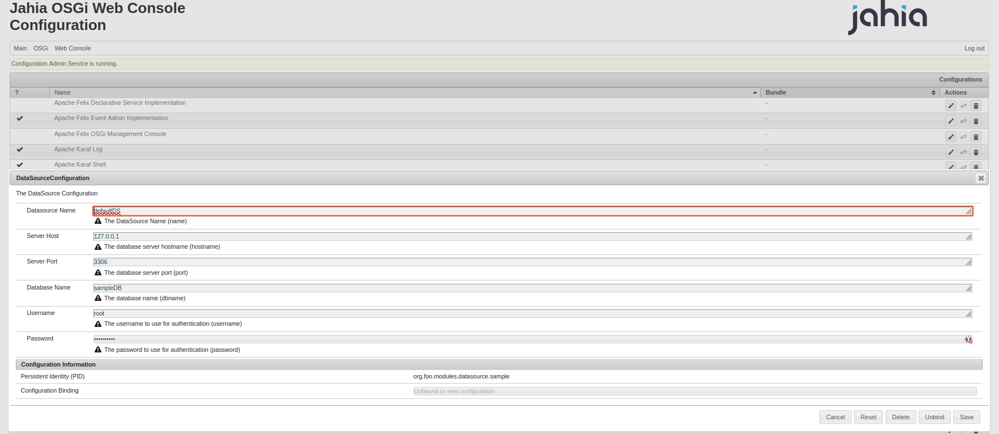

# OSGi modules datasource sample

This project contains examples of how to use OSGI modules with a Datasource. All the examples use Declarative Services annotations, which is the recommended way of building Jahia Modules. You can find the following examples:

- SampleDataSourceFactory : a basic example of how to create a datasource and publish it as a service.
- SampleDataSourceConsumer : a basic example of how to consume a datasource service.
- org.jahia.modules.sample.datasource : the configuration sample file to customize datasource properties.

## Module Dependencies

The module includes a JDBC driver for MariaDB as a maven dependency, the driver will then be embedded in the OSGI bundle.

Another approach would have been to use a JDBC driver compatible with OSGI and to deploy it as a dedicated bundle and to export relevant packages. 
Thus, the maven dependency could be marked with a 'provided' scope, avoiding the jar to be embedded in the datasource bundle. 
This solution may be more flexible and easier to maintain regarding upgrade of driver.

## DataSource Factory Service

The DataSourceFactory Service uses a dedicated object for configuration (DataSourceConfig). There is others way to provide the configuration as you may see
in the dedicated samples module : config-samples.

The DataSource will be notified when configuration changes occurs and will adapt the datasource binding accordingly.

The DataSource is registered using a dedicated name property value. This can be adapted to fit with more JNDI oriented naming strategy if you prefer.  
In the end, you have to use that name to bind the datasource in your consumer module.

The DataSource Factory configuration is really basic and you may have to add some specific configuration according to your needs (transaction isolation level, 
timeout, pooling, ...)

## DataSource Consumer

Using the data source is quite simple, you just have to inject the service in your component and use it. 

```java
@Reference(target = "(&(objectclass=javax.sql.DataSource)(datasource.name=sampleDS))")
private DataSource dataSource;
```

As mentioned before, the filter used to retrieve the service is based on the datasource name property. 

## Usage

Compile and deploy the module to a running Jahia container.

```bash
mvn clean install jahia:deploy -Djahia.deploy.targetContainerName=jahia
```

Use the bundle configuration tool to provide database connection information. (http://localhost:8080/tools/osgi/console/configMgr) : 

img:

You can also use the sample config file and deploy it in the Jahia'Karaf configuration folder : /var/jahia/karaf/etc/org.jahia.modules.sample.datasource.cfg

Notice: You may use environment variables in the configuration fields to avoid storing sensitive information in the configuration file.

## Test datasource connection

You can test the datasource in the JCR Console using the following groovy script : 

```groovy
def ds = org.jahia.osgi.BundleUtils.getOsgiService("javax.sql.DataSource","(datasource.name=sampleDS)");
def conn = ds.getConnection();
log.info("test:"+conn);
```
