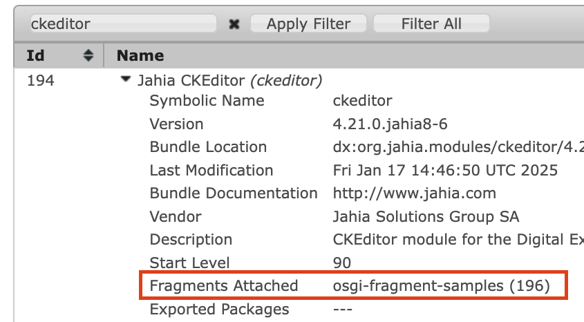
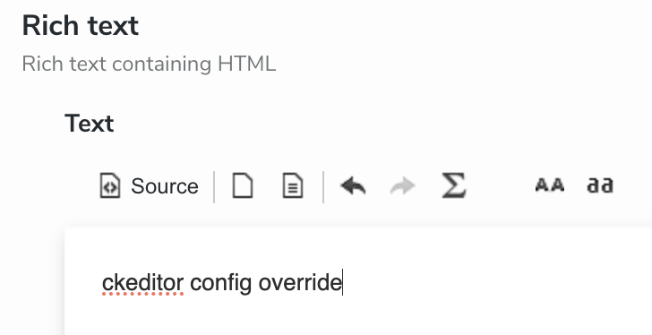

# Jahia OSGi Fragment Samples

This repository contains samples of Jahia OSGi fragment samples declared with OSGi

## How it works

Resources specified in src/main/resources are treated as part of the host bundle (ckeditor), specified as a `<Fragment-Host>` in `pom.xml`.

Here, we add `javascript/config.js` and any plugins in `javascript/ckeditor` as part of ckeditor module to override CKEditor configuration

## How to test it

### Requirements

- Install/start ckeditor module with version 4.21.0-jahia8-6 or above
- Created site using templates that do not have any ckeditor config overrides (e.g. luxe demo site, or templates-web-blue for 8.1)
  - To verify if global config is being applied, in browser dev console, check value of `contextJsParameters.ckeCfg` is `/modules/ckeditor/javascript/config.js`

### Steps

- Install osgi-fragment-samples jar through OSGi console tools (go to http://localhost:8080/tools/osgi/console/bundles and click on Install/Update..).
  - Verify fragment is attached to ckeditor by checking ckeditor bundle:

- Go to existing site (see requirements) and create rich text in jcontent or open existing rich text. Verify global override has been applied i.e. it should look similar to the following, with applied plugins showing:

